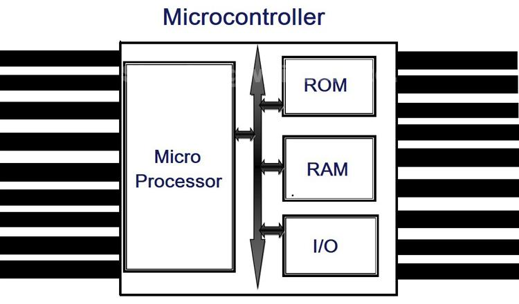

# Microprocesador vs Microcontrolador... ¿Cuál es la diferencia?

En escuelas y universidades, es común encontrar dificultades al distinguir entre microcontroladores y microprocesadores, ya que ambos términos son fundamentales en la electrónica programable. ELE Times, consciente de la importancia de contar con una base sólida en electrónica, ha proporcionado explicaciones claras sobre qué es cada uno de estos componentes.

## Puntos clave
1. [Costo Base](#coste)
2. [Velocidad de Reloj](#velocidad)
3. [Consumo de Energetico](#rendimiendo)

## *Coste...*
 Los microcontroladores suelen ser más económicos en comparación con los microprocesadores. Los microprocesadores están diseñados para dispositivos más costosos y son más complejos, destinados a realizar diversas tareas computacionales. Por otro lado, los microcontroladores cumplen funciones dedicadas y son programados específicamente para una aplicación en particular. Al tener todas las funciones y componentes necesarios internamente, se pueden cargar con el código correspondiente para ejecutar la tarea requerida.

## *Velocidad...*
  Existe una marcada diferencia en la velocidad del reloj entre microcontroladores y microprocesadores. Los microcontroladores están optimizados para manejar tareas específicas, lo que permite utilizar la cantidad precisa de velocidad y potencia requerida para realizar la tarea sin desperdiciar recursos. Por tanto, los microcontroladores suelen operar a velocidades más bajas, generalmente hasta 200 MHz o incluso menos. En cambio, los microprocesadores están diseñados para tareas más complejas y pueden alcanzar velocidades de reloj de hasta 4 GHz, lo que les permite realizar operaciones informáticas más robustas y diversas.
  
## *Rendimiendo*
Los microcontroladores se destacan por su bajo consumo de energía. Dado que están enfocados en tareas específicas y no requieren la misma potencia de cálculo que los microprocesadores, consumen menos energía para llevar a cabo su función. Esto es especialmente valioso en implementaciones donde se busca una mayor eficiencia energética. En contraste, los microprocesadores con mayor capacidad computacional pueden consumir más energía, lo que puede requerir una fuente de alimentación externa o una batería más grande para mantener su funcionamiento durante largos períodos de tiempo.

# ¿Qué es un microcontrolador?

*Figura 1. Estructura del MicroControlador

Un microcontrolador (a veces llamado MCU o unidad de microcontrolador) es un solo integrado circuito (IC) que se utiliza normalmente para una aplicación específica y está diseñado para implementar determinadas tareas. Los productos y dispositivos que deben controlarse automáticamente en determinadas situaciones, como electrodomésticos, herramientas eléctricas, sistemas de control de motores de automóviles y computadoras, son excelentes ejemplos, pero los microcontroladores van mucho más allá de estas aplicaciones.

En términos fundamentales, un microcontrolador desempeña la función de recopilar entradas, procesar la información y actuar en consecuencia según los datos obtenidos. Estos dispositivos suelen operar a velocidades más bajas, típicamente en el rango de 1MHz a 200 MHz, y su diseño se enfoca en minimizar el consumo de energía, ya que se integran dentro de otros dispositivos que pueden requerir una mayor demanda energética en otras áreas.

